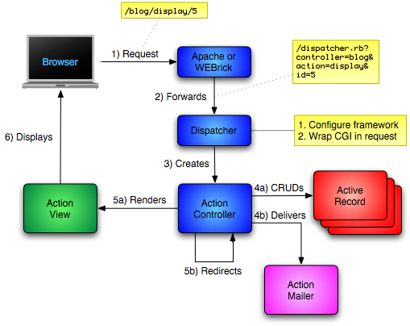

Model isimleri **tekil**, tablo isimleri **çoğul** olur.

Rest mimarisine göre URL adresinde sadece kaynaklara yer verilmeli, eylemlerden bahsedilmemelidir.

    sayfa_göster?15
    sayfalar/15

## İstek



Tarayıcıdan gelen isteği alan sunucu isteği **Action Pack** bileşeni olan **Action Dispatch** bileşenine iletir.
Bu bileşen ile config/routes dosyası kullanılarak kullanılacak Controller ve Action belirlenir. Yine **Action Pack** bileşeni olan
**Action Controller** bileşenine geçer.
Eğer **Action Controller** bileşenine gelen isteğin veri tabanı ile ilgili bir işlemi varsa gerekli model ile yani **Active Record** ile iletişime geçmektedir. **Action Controller** bileşenin bir diğer görevi ise **Action View** bileşenini tetikleyerek görünüm oluşturmaktır. **Action View** kullanılan şablona göre çıktıyı oluturup(HTML, JSON vs.) **Action Controller** bileşenine yollar ve **Action Controller** diğer HTTP bilgilerini ekleyerek sunucuya gönderir.

## Tablo ve Model isimleri

    "task".classify
    Task

    "person".tableize
    tasks

## Migration
ActiveRecord::Migration sınıfı

    rails g migration

    rails g migration CreateCars name doors_count:integer

default: string veri türü

    ```ruby
    def change
      create_table :cars do |t|
        t.string :name
        t.integer :doors_count
      end
    end
    ```

change: çift yönlü hem çalıştırılabilir, hem geri alınabilir

Aktarım isminde Create geçmezse change metodunu elle yazmamız gerekecek

    son aktarımı geri alma
    rake db:rollback
    rake db:rollback STEP=5

### Alan seçenekleri

    t.integer :age, null: false

    t.integer :age, default: 18

    t.integer :age, limit: 100
    t.string :name, limit: 50

    t.string :mail, unique: true
    büyük küçük harf ayrımı yapma
    t.string :mail, unique: { case_sensitive: false }

    t.decimal :salary, precision: 10, scale: 2
    ondalık = 2, basamak sayısı = 10

### Aktarım Tanımlama Metodları

create_table/drop_table

    create_table <tablo>, <secenek>, blok
    drop_table <tablo>
    rename_table <eski>, <yeni>

Column

    add_column <tablo>, <sütun>, <veri>, <secenek>
    add_column :cars, :licence, :string
    remove_column <tablo>, <sütun>
    change_column <tablo>, <sütun>, <yeni_sütun>

    rails g migration Create<tabloadi>
    rails g migration Change<tabloadi>
    rails g migration Add<tabloadi>To<sütun>
    rails g migration Remove<sütun>From<tabloadi>

### Rake

    rake -T db -A

    rake db:migrate:reset => drop + create + migrate
    rake db:setup: schema:load + seed

## Model İşlemleri

save: true/false döner
new/create: nesneyi döndürür

all: bir dizi döner

find - Bulamazsa ActiveRecord::RecordNotFound
find(1)
find(1,2,3,4) birini dahi bulamazsa RecordNotFound

find_by  nil
find_by! RecordNotFound
where
not

    User.find_by("name=? AND age=?", name, age)
    User.find_by("name = :name AND age = :age", {name: isim, age: yas})

    Car.where.not(make: "opel")

select

    Car.select(:make, :model)

pluck: sadece belirtilen sütunlardaki verilerden oluşan dizi

    Car.pluck(:make, :model)

uniq

    Car.pluck(:make).uniq

    DISTINCT
    Car.uniq.pluck(:make)

order

    Car.order(:year)
    Car.order("year DESC")

30 kayıttan başlayıp 15 tanesini getir

    Car.offset(30).limit(15)

count: kayıt sayısı
average: değerlerin ortalaması
sum
maximum
minimum

    Car.average(:year).to_f
    Car.minimum(:year)

update - true/false
update! - kayıt
update_all

    a = Car.where....
    a.update_all(year: 1905)

destroy

### Diğer İşlemler

#### Nümerik alanlar

Alan nil ise 0 kabul eder öyle işlem yapar

    araba = Car.find(1)

arttırma

    araba.increment(:year)
    araba.increment(:year, by = 8)

azaltma

    araba.decrement(:year)

#### Mantıksal Alanlar ile ilgili işlemler

    araba.toggle(:rented)
    araba.save

    araba.toggle!(:rented)

#### Touch

    araba.touch
    # updated tarihini günceller

## Konsol

Konsolu kapatınca değişiklikler silinsin

    rails c -s

Eğer konsol açıkken modeldeki değişikliklerin alınmasını istersek

    reload!

## Geçerlilik İlkeleri

update, save metodları false döner.
create nesneyi geri döndürür.
bang versionları ise ActiveRecord::RecordInvalid hatasını döndürür

    araba.valid?
    true
    araba.invalid?
    false

Geçersiz olsada kaydet

    araba.save(validate: false)

ActiveRecord::Errors

    araba.errors.to_yaml

@base: kaydetmeye çalışılan nesne
@messages: sözlük türünde hatalar

    araba.errors.any?
    true (hata var)

    araba.errors.messages[:make]
    araba.errors[:make]

    araba.errors.full_messages
    hataları içeren dizi döner

Presence boolean değerler için kullanılmamalı

    validates test, presence: true # olmak zorunda
    validates test, absence: true # olmamak zorunda
    validates test, absence: true, on: :update # güncelleme sırasında değiştirilemez

    validates test, uniqueness: true

    büyük küçük ayrımı yapma
    validates test, uniqueness: {case_sensitive: false}

    validates test, length: {
        maximum: 50,
        minimum: 2
    }
    validates test, length: {
        in: 2..50 # aralık
    }
    validates test, length: {
        is: 5 # 5 olacak
    }

    # numara olacak
    validates test, :numericality: true

    validates test, :numericality: {only_integer: true}

    only_integer: sadece tamsayı
    greater_than: sayıdan büyük olmalı
    less_than: az olmalı
    less_than_or_equal_to: eşit veya az
    equal_to: tam eşit
    odd: tek
    even: çift

Sadece belirtilen listedekileri kabul et/reddet

    inclusion: kabul
    validates :year, inclusion: {in: 1990..Time.now.year}
    validates :rented, inclusion: {in: [true, false]}

    exclusion: reddet

Format

    validates :email, format: {with: REGEX}

Acceptance - onay kutusu
Bu işlem için bir alan yoksa sanal bir alan yaratır.

    validates :terms_of_service, acceptance: true
    # varsayılan değer 1
    validates :terms_of_service, acceptance: {accept: evet}

Confirmation - tekrar girdirme

<sütun>_confirmation adında bir alan

    validates :email, confirmation: ture

Nil Blank değer

    boş olabilir
    validates :year, allow_blank: true

    nil olabilir
    validates :year, allow_nil: true

Message

    validates :email, presence: {message: "alan boş bırakılamaz"}

On seçeneği

Bir işlemin sadece güncelleme sırasında..

    validates :name, presence: true, on: :update
    :create, :update seçenekleri atanabilir
